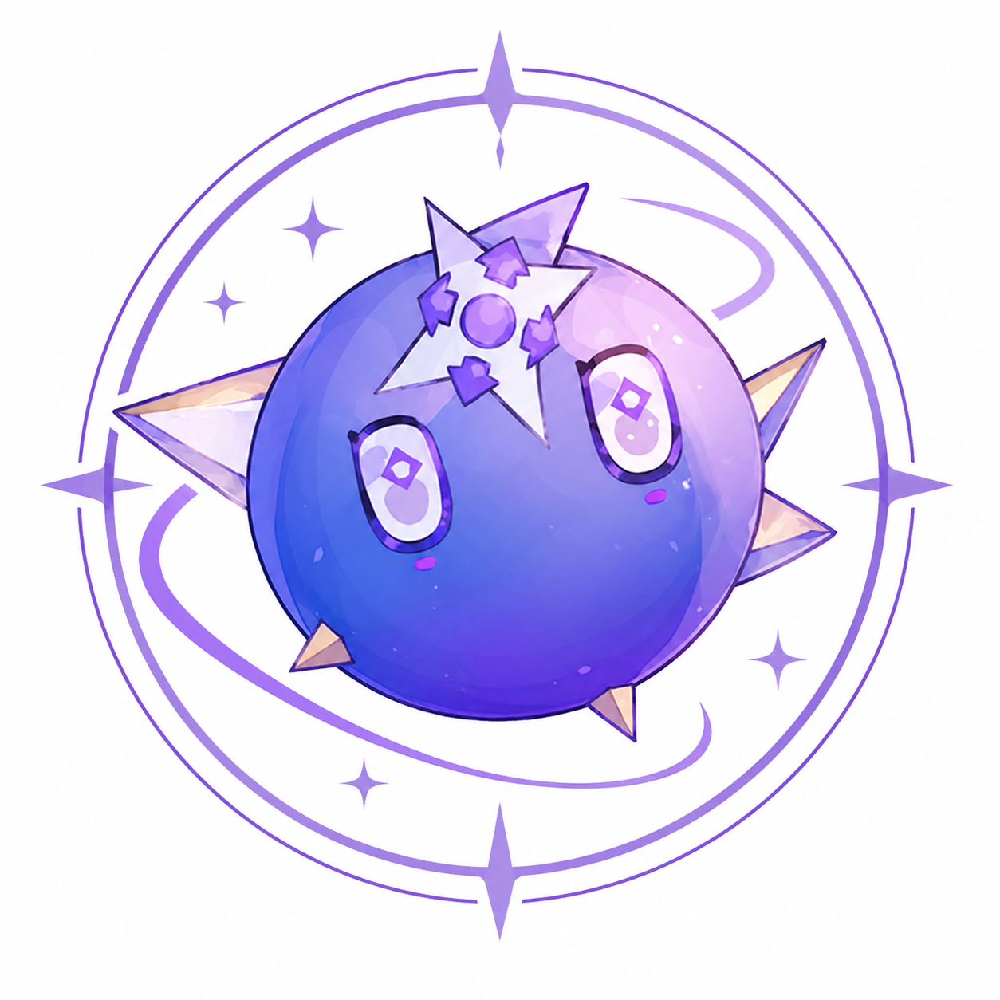

# CharonAnchor



Lagrange.Milky 签名服务

失败的作品·卡戎 - 拉格兰的现实锚定点

特别鸣谢: [LagrangeV2](https://github.com/LagrangeDev/LagrangeV2)

创造
============
```bash
./build.sh
```

锚定
============
将以下文件放在同一目录：
- `charon` · 主程序
- `wrapper.node` · 签名模块（从 Lagrange.Milky 依赖提取）
- `libsymbols.so` · 符号补丁
- `libbugly.so` · 依赖库
- `libcrbase.so` · 依赖库

运行：
```bash
./charon
```

人为构造
============
```
POST http://127.0.0.1:8080/api/sign/sec-sign

请求:
{
    "uin": 账号,
    "command": "命令字符串",
    "seq": 序列号,
    "body": "hex字符串(小写)",
    "guid": "hex字符串",
    "qua": "版本字符串"
}

响应:
{
    "code": 0,
    "message": null,
    "value": {
        "sec_sign": "hex",
        "sec_token": "hex",
        "sec_extra": "hex"
    }
}
```

自我投影
============
修改 `src/main.cpp` 中的 `SIGN_OFFSET` 值。

虚无
============
自助签名: [SignApiGuide](https://github.com/LagrangeDev/SignApiGuide)

自搭签名(仅支持linux x64): \
选择你喜欢的版本分支，按照下方`人为构造`描述，\
在`JSONC`的签名服务器中填入本地运行的`http://127.0.0.1:8080/api/sign/sec-sign`即可\
版本号需要💯完全一致Nya～

懒人签名(仅支持docker linux x64): [自用(版本写死的,每次更新需要更新整个框架！使用后果自负)](https://github.com/Bemly/CharonAnchor/tree/Lagrange-3.2.28)

开发学习: 获取[MEMORY.md](https://t.me/citron_bemly)和[学习插件](https://github.com/HexRaysSA/ida-claude-plugins)


------------
真相是这样的：一个脆弱的灵魂打造了这个破碎又诡异的牢笼，
而在这个牢笼之中，一切行动都被赋予了"理由"。
拉格兰伸出双手，紧紧抱住卡戎。它的眼睛闪着光芒。
看到这一幕，她问道："……你就是我那时候看见的指引之光吗？"
